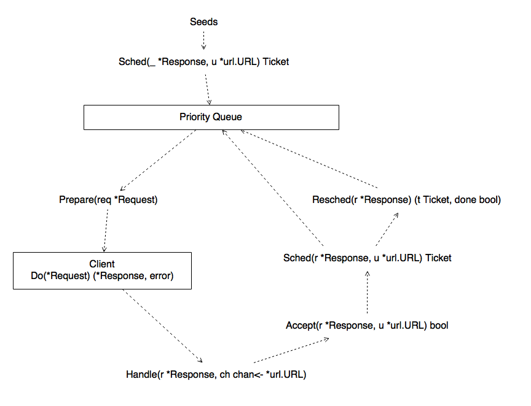

crawler
========

[](https://circleci.com/gh/fanyang01/crawler)
[](https://coveralls.io/github/fanyang01/crawler)
[](https://godoc.org/github.com/fanyang01/crawler)

crawler is a flexible web crawler framework written in Go.

## Quick Start

```go
package main

import (
	"log"
	"net/url"
	"strings"

	"github.com/fanyang01/crawler"
)

type controller struct {
	crawler.NopController
}

func (c *controller) Accept(_ *crawler.Response, u *url.URL) bool {
	return u.Host == "golang.org" && strings.HasPrefix(u.Path, "/pkg/")
}

func (c *controller) Handle(r *crawler.Response, ch chan<- *url.URL) {
	log.Println(r.URL.String())
	crawler.ExtractHref(r.NewURL, r.Body, ch)
}

func main() {
	ctrl := &controller{}
	c := crawler.New(&crawler.Config{
		Controller: ctrl,
	})
	if err := c.Crawl("https://golang.org"); err != nil {
		log.Fatal(err)
	}
	c.Wait()
}
```

## Design

`Controller` interface:

```go
// Controller controls the working progress of crawler.
type Controller interface {
	// Prepare sets options(client, headers, ...) for a http request.
	Prepare(req *Request)

	// Handle handles a response(writing to disk/DB, ...). Handle should
	// also extract hyperlinks from the response and send them to the
	// channel. Note that r.NewURL may differ from r.URL if r.URL has been
	// redirected, so r.NewURL should also be included if following
	// redirects is expected.
	Handle(r *Response, ch chan<- *url.URL)

	// Accept determines whether a URL should be processed. It is redundant
	// because you can do this in Handle, but it is provided for
	// convenience. It acts as a filter that prevents some unneccesary URLs
	// to be processed.
	Accept(r *Response, u *url.URL) bool

	// Sched issues a ticket for a new URL. The ticket specifies the next
	// time that this URL should be crawled at.
	Sched(r *Response, u *url.URL) Ticket

	// Resched is like Sched, but for URLs that have been crawled at least
	// one time. If r.URL is expected to be not crawled any more, return
	// true for done.
	Resched(r *Response) (done bool, t Ticket)

	// Retry gives the delay to retry and the maxmium number of retries.
	Retry(c *Context) (delay time.Duration, max int)

	Etc
}
```

Flowchart:


